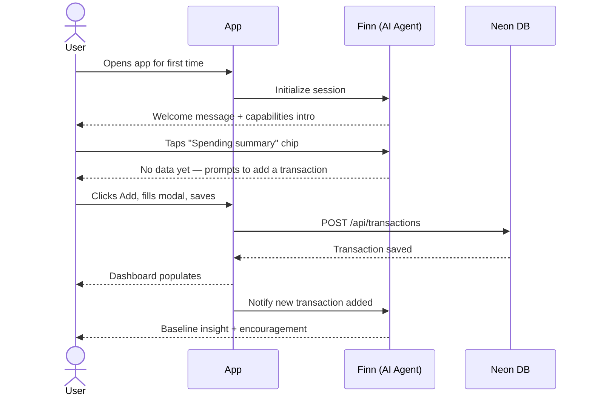
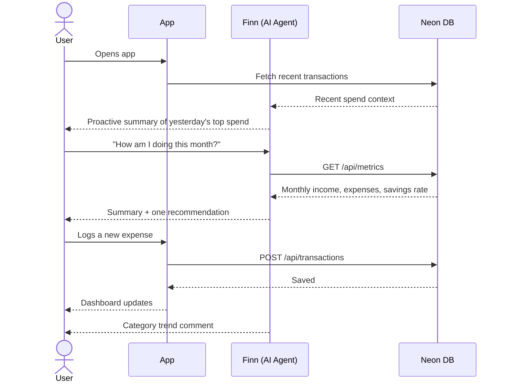
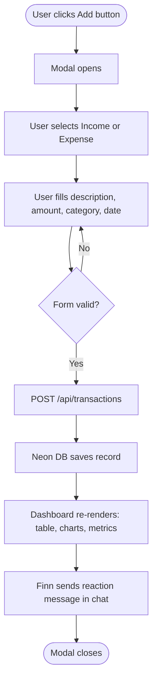
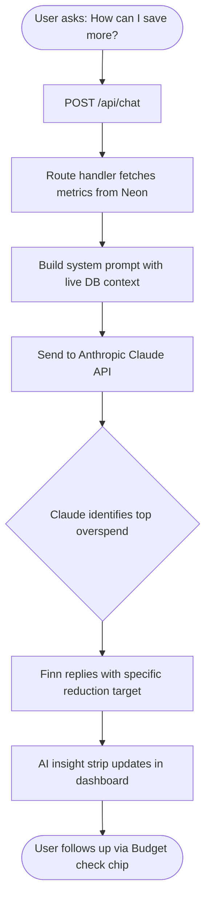
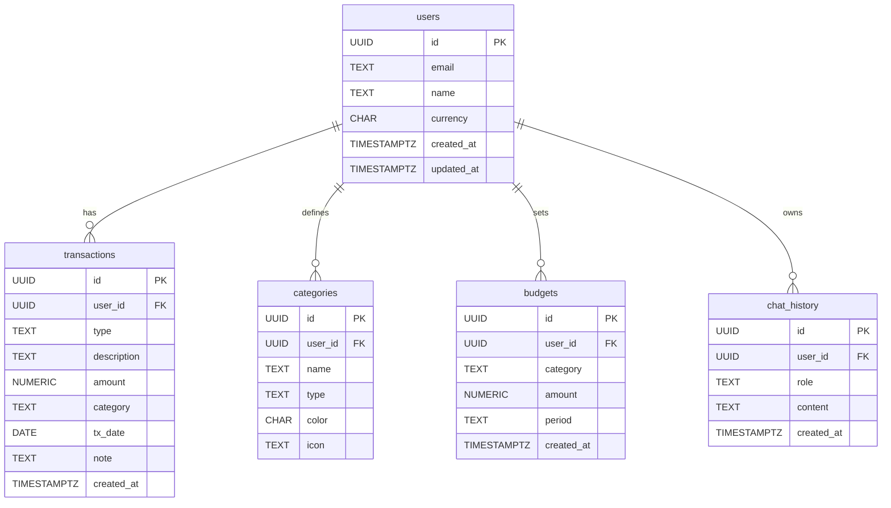

# Finn — AI Financial Tracker
### Product Requirements Document

---

## 1. Overview

Finn is an AI-powered personal finance application that combines a conversational chat interface with a real-time financial dashboard in a split-pane layout. Users interact with Finn — an intelligent finance agent built on Claude — to log transactions, understand spending behavior, and receive personalized money management recommendations. The dashboard updates live alongside the conversation, keeping actionable financial data always in view.

**Problem being solved:** Most finance tools are either passive dashboards that require manual interpretation, or narrow chatbots without real data context. Finn bridges both — giving users a single surface where they can talk about their money and see it visualized at the same time.

**Target users:**
- Urban professionals (25–38) who want to understand their spending without manually maintaining spreadsheets
- Freelancers managing variable income and multiple expense categories
- Anyone comfortable with AI chat interfaces who wants financial guidance grounded in their actual data

---

## 2. Requirements

### Functional Requirements

| ID | Requirement | Priority |
|----|-------------|----------|
| FR-01 | Users can send natural language messages to Finn and receive context-aware financial responses | P0 |
| FR-02 | Users can add income and expense transactions via a modal form | P0 |
| FR-03 | The dashboard displays real-time summary metrics: total income, total expenses, net savings | P0 |
| FR-04 | Charts visualize income vs expenses over time and spending by category | P0 |
| FR-05 | Finn's financial context updates automatically when a new transaction is added | P0 |
| FR-06 | Users can filter the dashboard by time period (week, month, year) | P1 |
| FR-07 | Finn proactively surfaces insights without the user asking (e.g. budget threshold alerts) | P1 |
| FR-08 | Transaction data persists across sessions | P1 |
| FR-09 | Users can set budget goals per category | P2 |
| FR-10 | Users can export transaction history as CSV or PDF | P2 |

### Non-Functional Requirements

- **Performance:** AI responses render within 2 seconds at p90; dashboard updates within 100ms of a transaction save
- **Security:** Financial data encrypted at rest (AES-256) and in transit (TLS 1.3)
- **Accessibility:** WCAG 2.1 AA compliant; full keyboard navigability and screen reader support
- **Reliability:** 99.5% uptime SLA; graceful degradation if AI API is unavailable
- **Privacy:** GDPR and PDPA compliant; user data deletable on request

---

## 3. Core Features

### 3.1 Conversational AI Agent
The primary interface is a chat panel where users talk to Finn. Every message is sent to the Claude API with the user's full financial context injected into the system prompt, so Finn always responds with awareness of actual balances, categories, and trends.

- Natural language Q&A about spending, savings, and budgets
- Quick-action chips for common queries (spending summary, savings tips, budget check, top expenses)
- Typing indicator and streaming response for low-latency feel
- Finn reacts to every new transaction with a contextual comment or tip
- Session-level conversation history for coherent multi-turn dialogue

### 3.2 Financial Dashboard
A persistent side panel rendered beside the chat. All widgets update in real time when transactions are added or the period filter changes.

- **Summary cards** — Total Income, Total Expenses, Net Savings with period-over-period change
- **Income vs Expenses bar chart** — grouped bars across 5 time periods (Chart.js)
- **Category breakdown doughnut chart** — spending split across Food, Transport, Health, Entertainment, Utilities
- **AI insight strip** — Finn's latest proactive insight pinned above the charts
- **Transactions table** — scrollable list with description, category badge, date, and signed amount
- **Period selector** — toggle between Week, Month, Year views

### 3.3 Transaction Management
- Add transaction modal with type toggle (Income / Expense), description, amount, category, and date fields
- Transactions auto-sorted by date descending in the table
- All metrics and charts recalculate on every add
- Category set: Income, Food & Dining, Transport, Health, Entertainment, Utilities

### 3.4 Personalized Recommendations
Finn analyzes the user's transaction history and surfaces actionable advice:

- Identifies the top overspending category with a specific reduction suggestion
- Calculates current savings rate and recommends a target
- Compares current period spend against prior period with trend commentary
- Flags recurring subscriptions that have increased in cost

---

## 4. User Flow

### Flow A — First-time user



### Flow B — Daily check-in (returning user)



### Flow C — Adding a transaction



### Flow D — Savings guidance



---

## 5. Architecture

### 5.1 System Overview

```mermaid
graph TD
    subgraph Client["Browser Client (Next.js)"]
        CP[Chat Panel]
        DP[Dashboard Panel]
        ST[Shared App State]
        CP <--> ST
        DP <--> ST
    end

    subgraph Server["Next.js API Routes (Vercel)"]
        TX[/api/transactions]
        CH[/api/chat]
        MT[/api/metrics]
        BG[/api/budgets]
        CT[/api/categories]
    end

    subgraph Data["Neon Serverless Postgres"]
        DB[(finndb)]
    end

    subgraph AI["Anthropic"]
        CL[Claude API]
    end

    ST -->|fetch| TX
    ST -->|fetch| CH
    ST -->|fetch| MT
    TX <-->|SQL| DB
    MT <-->|SQL| DB
    BG <-->|SQL| DB
    CT <-->|SQL| DB
    CH -->|query context| DB
    CH -->|messages + context| CL
    CL -->|AI response| CH
```

### 5.2 Frontend

- **Framework:** Next.js 14 (App Router) with React server and client components
- **Charts:** Chart.js 4.x — bar chart for income vs expenses, doughnut chart for category breakdown
- **Layout:** CSS Grid split-pane — chat panel fixed width, dashboard fluid
- **Theming:** CSS custom properties for light/dark mode adaptive colors
- **State:** React `useState` for client components; server components fetch directly from Neon on initial load

### 5.3 Backend — Next.js API Routes

All server logic lives in `app/api/` as Next.js Route Handlers. The Anthropic API key and Neon connection string never leave the server.

| Route | Method | Purpose |
|-------|--------|---------|
| `/api/transactions` | GET | List transactions filtered by user and period |
| `/api/transactions` | POST | Create a new transaction |
| `/api/transactions/:id` | DELETE | Remove a transaction |
| `/api/metrics` | GET | Aggregated income, expenses, and savings |
| `/api/categories` | GET | List system and user-defined categories |
| `/api/budgets` | GET / POST | List or upsert budget goals per category |
| `/api/chat` | POST | Proxy to Claude; fetches DB context before calling API |

### 5.4 Database Layer — Neon Postgres

- **Provider:** Neon — serverless Postgres with branching and autoscaling
- **Driver:** `@neondatabase/serverless` — HTTP-based driver, safe in Next.js Edge and serverless runtimes without connection pool exhaustion
- **Connection:** Single `DATABASE_URL` environment variable; Neon handles pooling automatically
- **Branching:** Neon branch-per-PR workflow for safe schema migrations in CI/CD
- **Migrations:** Sequential SQL files applied via `drizzle-kit push` on deploy

### 5.5 Deployment Stack

| Layer | Technology |
|-------|-----------|
| Frontend + API | Next.js 14 on Vercel (App Router) |
| Database | Neon serverless Postgres |
| Auth | NextAuth.js v5 (email + OAuth) |
| AI | Anthropic Claude API (server-side only) |
| DB client | `@neondatabase/serverless` |
| Migrations | `drizzle-orm` / `drizzle-kit` |
| CI/CD | GitHub Actions + Neon branch-per-PR |

---

## 6. Database Schema

**Database:** Neon serverless Postgres  
**Driver:** `@neondatabase/serverless`  
**Migration approach:** Sequential SQL files in `migrations/` applied via `drizzle-kit push` on deploy

### Entity Relationship Diagram



### Tables

**users** — Registered accounts. Stores auth identity and preferred currency.

**transactions** — Core financial records. `type` is either `income` or `expense`. `amount` is always stored as a positive value; sign is derived from `type` at query time. Indexed on `(user_id, tx_date DESC)` and `(user_id, category)` for fast filtered aggregations.

**categories** — Expense and income categories. Rows with `user_id = NULL` are system-wide defaults visible to all users; rows with a non-null `user_id` are custom categories created by that user.

**budgets** — Optional spending limits per category per period (`weekly`, `monthly`, `yearly`). Unique on `(user_id, category, period)` so an upsert pattern is used when updating a goal.

**chat_history** — Persisted conversation turns per user. Loaded at session start to inject the last N messages into Finn's system prompt, enabling cross-session continuity. Indexed on `(user_id, created_at DESC)`.

### Key Design Decisions

- `amount` is always a positive `NUMERIC` — `type` determines sign at query time, keeping aggregations clean and avoiding signed arithmetic errors
- `categories.user_id = NULL` denotes system defaults; user-created categories always have a non-null `user_id`
- `chat_history` is persisted per user so Finn maintains context across sessions without requiring the client to store conversation state
- All primary keys are UUIDs to prevent sequential ID enumeration attacks
- `tx_date` is `DATE` not `TIMESTAMPTZ` — time-of-day precision is not needed for personal financial tracking
- Neon's HTTP-based driver is safe in Next.js Edge runtime and serverless functions where persistent TCP connections are not supported\n## Project Status\n- Initial implementation completed and pushed to main.
